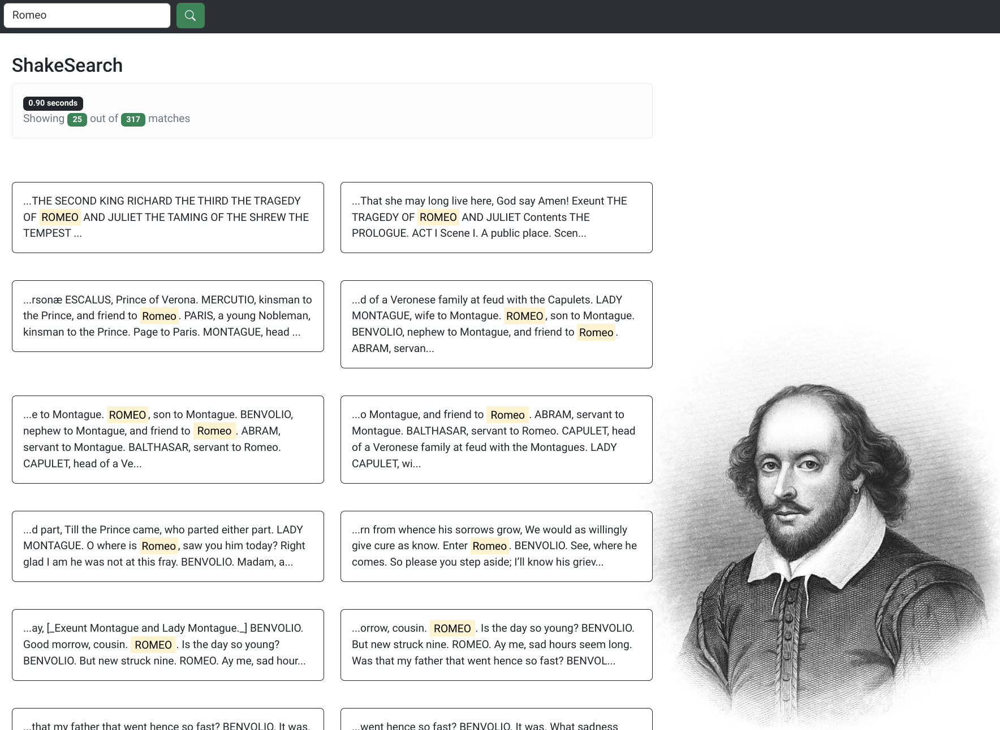

# ShakeSearch

## What Is It?

[Shakesearch](https://pulley-shakesearch.onrender.com/) is a simple web app that allows a user to search for a text string in the complete works of Shakespeare.

However, the app is in a rough shape. The search is case sensitive, the results are difficult to read, and the search is limited to exact matches.

## My Mission

Improve the app!
Think about the problem from the **user's perspective** and prioritize changes according to what I think is most useful.

> I am at liberty to approach the improvements with a back-end, front-end, or full-stack focus.

## Submission

> :rocket: Live app : https://tph-shakesearch.onrender.com/

---

- [Plan](https://github.com/users/chalu/projects/1/views/1)
- [Prioritization](https://github.com/users/chalu/projects/1/views/3)
- [Execution](https://github.com/users/chalu/projects/1/views/2)

### Changes Implemented

:fire: :fire: :fire:

1.  Designed [an API](https://tph-shakesearch.onrender.com/api/) as the contract between clients and the server implementation
2.  Enhanced the UI/UX. Applied responsive design with best practices for [web](https://pagespeed.web.dev/report?url=https%3A%2F%2Ftph-shakesearch.onrender.com%2F&form_factor=desktop) and [mobile](https://pagespeed.web.dev/report?url=https%3A%2F%2Ftph-shakesearch.onrender.com%2F)
3.  Support for case-insensitive search
4.  Support highlighting the occurences of the search term within each displayed result
5.  Ability to load the app with a search term in the URL and automatically execute the search. E.g `https://tph-shakesearch.onrender.com/?q=Hamlet` will load the app and issue a search for `Hamlet`. Users can now create bookmarks of searches or send search URLs to friends
6.  Validate search queries both on client and backend. How helpful is it to seach for two letter words?
7.  Support pagination (no UI yet) and prevent sending hundreds (potentially thousands) of results at once, when user might likely only see/consume a few
8.  Prevent unecessary trips to backend by **not** issuing a search if the query is the same as what was last searched
9.  Enable CORS on server to enable API integrators (from other domains) search via API
10. Lots of code refator and enhancements across frontend and backend. See how [quality progressed over time](https://app.codacy.com/gh/chalu/shakesearch/dashboard?branch=dev) and see code quality status badge at top of this repo

### If I Had More Time ...

:muscle: :muscle: :muscle:

1.  Support multi-word search
2.  Support search with mis-spelt words
3.  Add pagination UI so that user can navigate across all the results. Add `next` and `previous` links in response payload so that integrators/clients don't have to construct them
4.  Support results `ordering` and `sorting` by specified enums. E.g order the results by the frequency of the search term
5.  Perform search as fewer times as possible. Cache results for subsequent requests
6.  Search with voice
